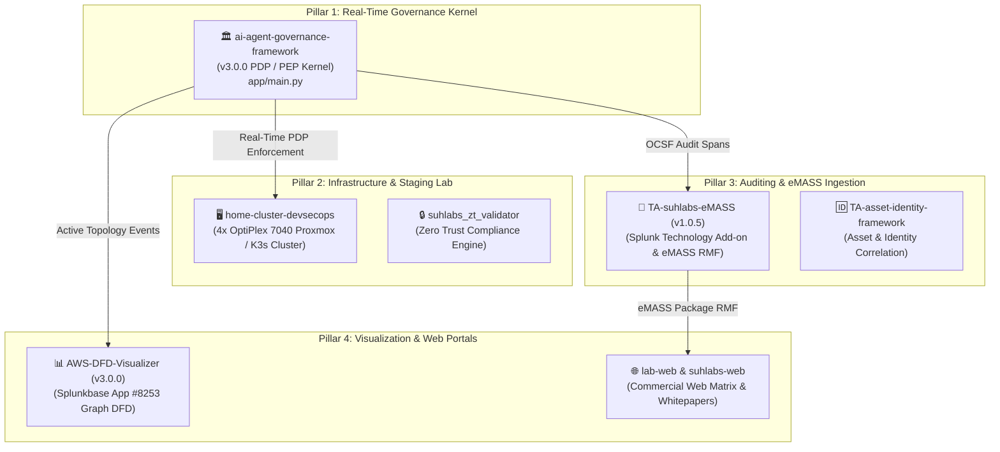
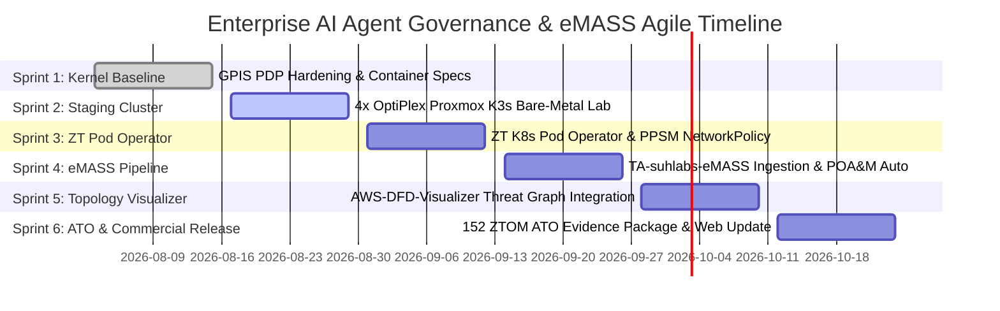

# Enterprise AI DevSecOps & Governance — Agile Release Timeline Roadmap

**Program Title:** Enterprise AI Agent Governance & eMASS Automated RMF Platform  
**Target Accreditation:** DoD Zero Trust Overlay Model (152 ZTOM Controls) / FedRAMP Moderate / DoD IL5  
**Ecosystem Scope:** `ai-agent-governance-framework` + `home-cluster-devsecops` + `TA-suhlabs-eMASS` + `AWS-DFD-Visualizer` + `lab-web`  

---

## 1. Multi-Project Ecosystem Mapping

Our enterprise platform consists of 4 tightly integrated functional pillars:

---

## 2. Six-Sprint Agile Timeline (Q3–Q4 Release Plan)

Each sprint runs on a **2-week cadence** focused on delivering verifiable, test-backed capability milestones across the ecosystem:

---

## 3. Sprint Breakdown & Acceptance Criteria

### 🏁 Sprint 1: PDP Kernel Hardening & Container Baseline (AUG 3 – AUG 15) — COMPLETED
* **Target Project**: `ai-agent-governance-framework` (v3.0.0)
* **Deliverables**:
  - Enforce `GPIS_JWT_SECRET` env var ([SEC-001](file:///home/suhlabs/projects/suhlabs/ai-agent-governance-framework/NEXT_RELEASE_TODO.md#L20)).
  - Resolve CVE policy logic ambiguity in `evaluate_security_patch_deployment()` ([SEC-002](file:///home/suhlabs/projects/suhlabs/ai-agent-governance-framework/NEXT_RELEASE_TODO.md#L31)).
  - Add `/health`, `/ready`, and `/api/v1/verify` endpoints.
  - Multi-stage `app/Dockerfile` with non-root `UID 65534` compliance.
  - IP boundary exporter (`scripts/export-external-sdk.sh`).
* **Done Criteria**: 21/21 pytest cases pass, 0 secret scan warnings.

### 🏃 Sprint 2: Bare-Metal Staging Hardware Cluster (AUG 17 – AUG 29) — ACTIVE
* **Target Projects**: `home-cluster-devsecops` + `ai-agent-governance-framework`
* **Deliverables**:
  - Install Proxmox VE 8.x across 4x Dell OptiPlex 7040s.
  - Provision 4-node K3s cluster (`ai-agents-staging` namespace).
  - Deploy Dell XPS 9500 NVIDIA GPU Node running Ollama (`qwen2.5-coder:7b`) for local intent routing.
  - Deploy `values-k3s.yaml` Helm release to staging cluster.
* **Done Criteria**: `kubectl get pods -n ai-agents-staging` returns 100% Running status.

### 🏃 Sprint 3: ZT Pod Operator & PPSM NetworkPolicy Enforcement (AUG 31 – SEP 12)
* **Target Projects**: `suhlabs_zt_validator` + `ai-agent-governance-framework`
* **Deliverables**:
  - Implement ZT Pod Operator to provision Pods with non-root `nobody` security contexts.
  - Apply default-deny `networkpolicy.yaml` enforcing L4/L7 PPSM isolation (`policies/ppsm/ppsm-registry.yml`).
  - Wire CyberArk Conjur sidecar for short-lived ephemeral secret fetching.
* **Done Criteria**: Direct agent access to Redis (`:6379`) or Chroma VectorDB (`:8002`) blocked by CNI.

### 🏃 Sprint 4: eMASS Pipeline & Automated POA&M Generation (SEP 14 – SEP 26)
* **Target Projects**: `TA-suhlabs-eMASS` + `apidog-emass-yaml` + `SA-eMASS-sec-eMASS`
* **Deliverables**:
  - Ingest OCSF audit telemetry emitted by `otel-siem-emitter.py`.
  - Auto-map agent execution spans to NIST 800-53 Rev 5 controls.
  - Generate automated eMASS POA&M, SAP, and SSP evidence packages.
* **Done Criteria**: `TA-suhlabs-eMASS` ingests 100% of AGT audit events into Splunk index `ai_logs`.

### 🏃 Sprint 5: AWS-DFD-Visualizer Threat Graph Integration (SEP 28 – OCT 10)
* **Target Projects**: `AWS-DFD-Visualizer` (Splunkbase App #8253)
* **Deliverables**:
  - Render active agent communication flows on DFD graph canvas.
  - Implement visual "Red Pulse" alerts when governance violations occur.
  - Compare "As-Is" existing cluster topology vs "To-Be" ZT target architecture.
* **Done Criteria**: Splunkbase app `#8253` renders live real-time governance state transitions.

### 🏁 Sprint 6: 152 ZTOM ATO Package & Web Matrix Release (OCT 12 – OCT 24)
* **Target Projects**: `lab-web` + `suhlabs-web` + All Repositories
* **Deliverables**:
  - Consolidate final 152 ZTOM DoD Zero Trust compliance package.
  - Publish updated commercial project matrix & whitepapers to `lab-web`.
  - Issue official v3.0.0 enterprise release.
* **Done Criteria**: 100% 152 ZTOM capability coverage verified; web matrix published.
