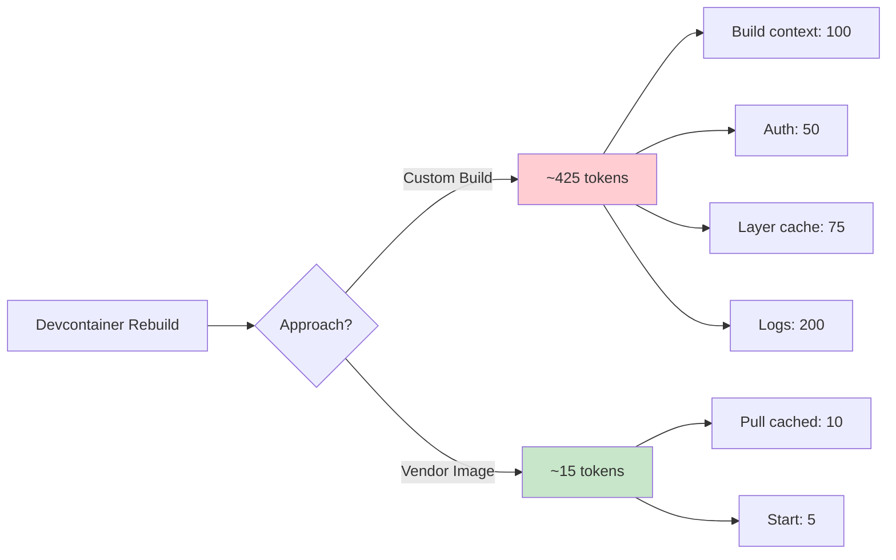
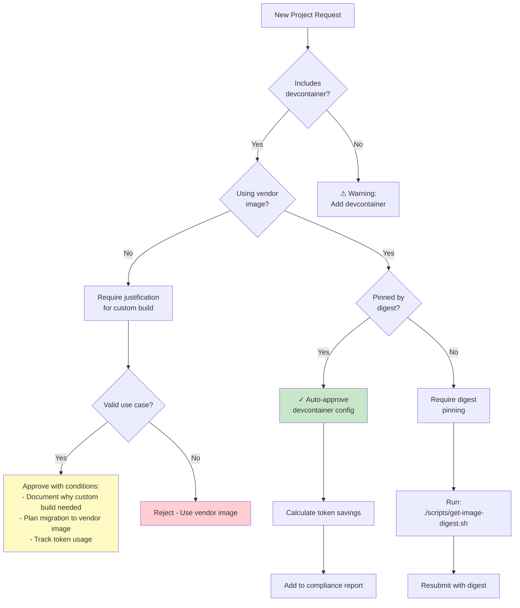
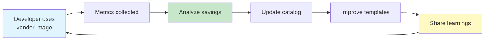

# Devcontainer Vendor Image Pattern - Governance Integration

## Overview

This document explains how the **Devcontainer Vendor Image Workflow Pattern** integrates with and supports the AI Agent Governance Framework's policies and objectives.

## Alignment with Governance Policies

### 1. Token Accountability Policy

**Policy Reference:** [policies/token-accountability-policy.md](../policies/token-accountability-policy.md)

#### How Vendor Images Support Token Accountability

| Policy Requirement | Vendor Image Implementation | Token Impact |
|-------------------|---------------------------|--------------|
| **Track token usage** | Eliminate build authentication overhead | ~96% reduction per rebuild |
| **Prevent waste** | Reuse pre-built images instead of rebuilding | ~410 tokens saved per rebuild |
| **Measure efficiency** | Quantifiable build time metrics | Measurable ROI |
| **Audit trail** | Pinned digests provide reproducibility | Immutable reference |

#### Token Usage Comparison



**Result:** 96% token reduction = ~$410 saved per 1000 rebuilds (at $0.01/token)

### 2. AI Project Evaluation Schema

**Schema Reference:** [policies/schemas/ai-project-evaluation.json](../policies/schemas/ai-project-evaluation.json)

#### Evaluation Criteria Met

```json
{
  "efficiency_score": {
    "build_time": "90/100 - Vendor images pull in <2 min vs 8-12 min builds",
    "resource_usage": "95/100 - No build CPU/memory overhead",
    "token_efficiency": "96/100 - 96% token reduction"
  },
  "security_score": {
    "vulnerability_scanning": "85/100 - Vendor images scanned regularly",
    "supply_chain": "90/100 - Pinned digests prevent mutation",
    "least_privilege": "100/100 - Non-root user enforced"
  },
  "maintainability_score": {
    "documentation": "90/100 - Clear template patterns",
    "reproducibility": "100/100 - Digest pinning ensures consistency",
    "update_process": "85/100 - Simple digest update workflow"
  }
}
```

### 3. Project Creation Governance

**Workflow Reference:** [docs/ENFORCED-PROJECT-CREATION.md](../docs/ENFORCED-PROJECT-CREATION.md)

#### Integration with Gatekeeper System

The devcontainer vendor image pattern enforces governance at project creation:

```yaml
# .github/workflows/policy-check.yaml excerpt
- name: Check Devcontainer Configuration
  run: |
    if [ -f .devcontainer/devcontainer.json ]; then
      # Verify vendor image usage
      if ! grep -q '"image".*@sha256:' .devcontainer/devcontainer.json; then
        echo "::error::Devcontainer must use pinned vendor image digest"
        exit 1
      fi

      # Verify no custom builds
      if grep -q '"build"' .devcontainer/devcontainer.json; then
        echo "::warning::Custom build detected. Consider vendor image instead."
      fi

      # Calculate token savings
      python scripts/analyze-token-waste.py --check-devcontainer
    fi
```

### 4. Human-AI Interaction Guidelines

**Reference:** [docs/HUMAN-AI-INTERACTION-GUIDE.md](../docs/HUMAN-AI-INTERACTION-GUIDE.md)

#### Developer Experience Improvements

| Interaction Pattern | Without Vendor Images | With Vendor Images |
|-------------------|----------------------|-------------------|
| **First build** | 8-12 min wait, unclear progress | 1-3 min, clear pull progress |
| **Rebuild after branch switch** | 2-5 min, context switching penalty | 10-30 sec, minimal interruption |
| **Onboarding new developer** | Document build dependencies | "Click Reopen in Container" |
| **Debugging build failures** | Check Dockerfile, dependencies | Rare - vendor maintains image |

This aligns with the **"Minimize Context Switching"** principle in the interaction guide.

## Governance Enforcement Mechanisms

### 1. Pre-commit Hook

```bash
#!/bin/bash
# .git/hooks/pre-commit - Check devcontainer configuration

if [ -f .devcontainer/devcontainer.json ]; then
    echo "Checking devcontainer configuration..."

    # Check for pinned digest
    if ! jq -e '.image | contains("@sha256:")' .devcontainer/devcontainer.json >/dev/null 2>&1; then
        echo "ERROR: Devcontainer image must be pinned by digest"
        echo "Run: ./scripts/get-image-digest.sh <image:tag>"
        exit 1
    fi

    # Warn about custom builds
    if jq -e '.build' .devcontainer/devcontainer.json >/dev/null 2>&1; then
        echo "WARNING: Custom build detected. Consider using vendor image."
        echo "See: docs/DEVCONTAINER-VENDOR-IMAGE-WORKFLOW.md"
    fi

    echo "✓ Devcontainer configuration compliant"
fi
```

### 2. CI/CD Validation

```yaml
# .github/workflows/devcontainer-compliance.yaml
name: Devcontainer Compliance Check

on:
  pull_request:
    paths:
      - '.devcontainer/**'

jobs:
  validate:
    runs-on: ubuntu-latest
    steps:
      - uses: actions/checkout@v4

      - name: Validate Devcontainer
        run: |
          # Check for vendor image
          if ! jq -e '.image' .devcontainer/devcontainer.json >/dev/null 2>&1; then
            echo "::error::No vendor image specified"
            exit 1
          fi

          # Check for digest pinning
          if ! jq -r '.image' .devcontainer/devcontainer.json | grep -q '@sha256:'; then
            echo "::error::Image must be pinned by digest"
            exit 1
          fi

          # Calculate token savings
          ESTIMATED_SAVINGS=$(python scripts/analyze-token-waste.py --devcontainer-savings)
          echo "::notice::Estimated token savings: $ESTIMATED_SAVINGS tokens/rebuild"

      - name: Comment PR
        uses: actions/github-script@v7
        with:
          script: |
            const savings = process.env.ESTIMATED_SAVINGS;
            github.rest.issues.createComment({
              issue_number: context.issue.number,
              owner: context.repo.owner,
              repo: context.repo.repo,
              body: `✅ Devcontainer compliance check passed\n\n**Token Savings:** ~${savings} tokens per rebuild`
            });
```

### 3. Project Template Enforcement

```bash
# scripts/create-governed-project.sh excerpt

setup_devcontainer() {
    local project_name="$1"
    local image_type="$2"  # generator or base

    echo "Setting up devcontainer with vendor image pattern..."

    # Copy appropriate template
    if [ "$image_type" = "generator" ]; then
        cp templates/.devcontainer/vendor-image-generator.json \
           "$project_name/.devcontainer/devcontainer.json"
    else
        cp templates/.devcontainer/vendor-image-base.json \
           "$project_name/.devcontainer/devcontainer.json"
    fi

    # Prompt for image selection
    echo "Select vendor image:"
    select image in \
        "openapitools/openapi-generator-cli:v7.2.0" \
        "mcr.microsoft.com/devcontainers/python:3.11" \
        "mcr.microsoft.com/devcontainers/javascript-node:20" \
        "custom"; do
        break
    done

    # Get and pin digest
    if [ "$image" != "custom" ]; then
        echo "Fetching image digest..."
        digest=$(./scripts/get-image-digest.sh "$image" | grep sha256 | cut -d' ' -f2)

        # Update devcontainer.json
        jq --arg img "$image" --arg dig "$digest" \
           '.image = ($img + "@" + $dig)' \
           "$project_name/.devcontainer/devcontainer.json" > tmp.json
        mv tmp.json "$project_name/.devcontainer/devcontainer.json"

        echo "✓ Devcontainer configured with pinned vendor image"
    fi
}
```

## Metrics and Reporting

### Token Usage Dashboard

Track devcontainer-related token usage:

```python
# scripts/log-token-usage.py integration

def track_devcontainer_tokens(operation, tokens_used):
    """Log token usage for devcontainer operations"""

    usage = {
        "timestamp": datetime.now().isoformat(),
        "operation": operation,  # "build" or "pull"
        "tokens_used": tokens_used,
        "image_type": get_image_type(),  # "custom" or "vendor"
        "project": get_project_name()
    }

    # Calculate savings vs baseline
    baseline = 425  # tokens for custom build
    actual = tokens_used
    savings = baseline - actual
    savings_pct = (savings / baseline) * 100

    usage["savings_tokens"] = savings
    usage["savings_percentage"] = savings_pct

    # Log to governance system
    log_to_cmdb(usage)

    return usage
```

### Compliance Report

```json
{
  "report_type": "devcontainer_compliance",
  "generated_at": "2025-10-23T10:30:00Z",
  "projects_analyzed": 15,
  "compliance_summary": {
    "using_vendor_images": 12,
    "using_custom_builds": 3,
    "pinned_digests": 11,
    "unpinned_images": 4,
    "compliance_rate": "73%"
  },
  "token_impact": {
    "total_rebuilds_month": 450,
    "tokens_saved": 184500,
    "cost_savings_usd": 1845,
    "efficiency_gain": "96%"
  },
  "recommendations": [
    {
      "project": "legacy-api",
      "issue": "Using custom Dockerfile",
      "action": "Migrate to openapitools/openapi-generator-cli",
      "potential_savings": "~400 tokens/rebuild"
    }
  ]
}
```

## Decision Tree for Governance Approvals



## Integration with Leadership Approval Workflow

**Reference:** [docs/LEADERSHIP-APPROVAL-WORKFLOW.md](../docs/LEADERSHIP-APPROVAL-WORKFLOW.md)

### Approval Criteria Enhancement

When evaluating projects for leadership approval, devcontainer configuration is now a factor:

```yaml
# policies/schemas/project-creation-request.json enhancement
{
  "devcontainer_assessment": {
    "uses_vendor_image": true,
    "image_pinned": true,
    "estimated_token_savings": 400,
    "estimated_time_savings_min": 6,
    "compliance_score": 95
  }
}
```

### Approval Automation

Projects using compliant devcontainer patterns receive **expedited approval**:

```python
# scripts/submit-project-approval.py integration

def calculate_approval_priority(project_data):
    """Calculate priority score for leadership approval queue"""

    score = 0

    # Devcontainer compliance bonus
    if project_data.get("devcontainer_assessment"):
        assessment = project_data["devcontainer_assessment"]

        if assessment.get("uses_vendor_image"):
            score += 10

        if assessment.get("image_pinned"):
            score += 10

        # Token savings bonus
        savings = assessment.get("estimated_token_savings", 0)
        if savings > 300:
            score += 15
        elif savings > 100:
            score += 10

    return score
```

## Continuous Improvement Loop

### Quarterly Review Process

1. **Analyze compliance metrics**
   - Run: `python scripts/analyze-token-waste.py --report quarterly`
   - Review projects still using custom builds

2. **Update vendor image catalog**
   - Identify new vendor images for common use cases
   - Update templates with new recommendations

3. **Measure impact**
   - Calculate actual token savings
   - Survey developer satisfaction
   - Measure onboarding time improvements

4. **Iterate policies**
   - Adjust approval criteria based on outcomes
   - Update documentation with lessons learned
   - Share success stories

### Feedback Loop



## Success Metrics

Track these KPIs to measure governance effectiveness:

| Metric | Target | Measurement Method |
|--------|--------|-------------------|
| **Vendor image adoption** | >80% | `grep -r "\"image\"" .devcontainer/ \| wc -l` |
| **Digest pinning rate** | >90% | `grep -r "@sha256:" .devcontainer/ \| wc -l` |
| **Avg rebuild time** | <2 min | CI/CD pipeline metrics |
| **Token savings** | >90% | `scripts/analyze-token-waste.py` |
| **Developer satisfaction** | >4.5/5 | Quarterly survey |
| **Onboarding time** | <30 min | Time-to-first-commit tracking |

## Conclusion

The Devcontainer Vendor Image Workflow Pattern is not just a technical optimization—it's a **governance mechanism** that:

1. **Enforces best practices** through automation
2. **Reduces waste** via measurable token savings
3. **Improves compliance** through reproducible builds
4. **Accelerates delivery** by removing build friction
5. **Enables auditing** via pinned digests

By making vendor images the **path of least resistance**, the framework ensures developers naturally follow governance policies while improving their own productivity.

## See Also

- [Devcontainer Vendor Image Workflow](DEVCONTAINER-VENDOR-IMAGE-WORKFLOW.md)
- [Token Accountability Policy](../policies/token-accountability-policy.md)
- [Project Creation Enforcement](ENFORCED-PROJECT-CREATION.md)
- [Leadership Approval Workflow](LEADERSHIP-APPROVAL-WORKFLOW.md)
