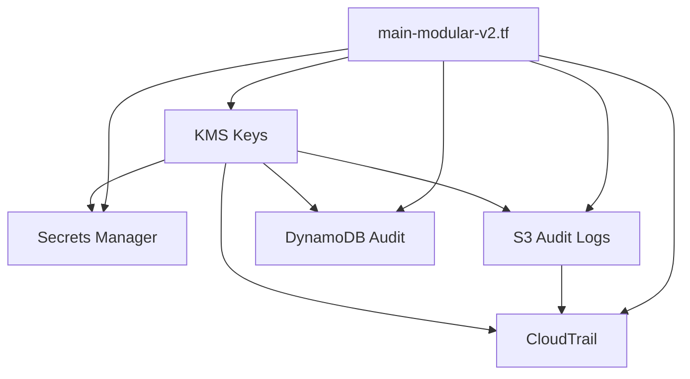

# Terraform Modular Architecture for AI Agent Governance Framework

**Version:** 2.1
**Last Updated:** 2025-11-06
**Purpose:** Document modular Terraform architecture with control ID correlation

---

## Architecture Overview

The AI Agent Governance Framework uses a **modular Terraform architecture** to ensure:

- **Separation of Concerns**: Each module handles a specific governance control area
- **Reusability**: Modules can be reused across different agent deployments
- **Control Correlation**: Every resource is tagged with governance control IDs
- **Audit Traceability**: All deployments are correlated with Jira CRs and audit trails

---

## Module Structure

```
terraform/
├── main-modular-v2.tf          # Primary modular configuration
├── variables-modular-v2.tf     # Module variables
├── outputs-modular-v2.tf       # Module outputs with control correlation
└── modules/
    ├── kms/                    # KMS key management (SEC-001, MI-003, SC-028)
    ├── s3_audit_logs/          # S3 audit log storage (AU-002, G-07)
    ├── cloudtrail/             # CloudTrail audit logging (AU-002, SEC-002)
    ├── secrets_manager/        # Secrets management (SEC-001, MI-003)
    ├── dynamodb_audit/         # DynamoDB audit trail (AU-002, G-07)
    └── networking/             # VPC and network security (AC-004, SC-007)
```

---

## Core Modules

### 1. KMS Module (`modules/kms`)

**Purpose**: Create and manage KMS encryption keys with automatic rotation

**Controls**: `SEC-001`, `MI-003`, `SC-028`

**Features**:
- Automatic key rotation (365-day cycle)
- Least-privilege key policies
- Multi-region replication support
- Audit logging integration

**Usage**:
```hcl
module "kms_secrets" {
  source = "./modules/kms"

  key_alias               = "ai-agent-secrets-prod"
  key_description         = "KMS key for AI agent secrets encryption"
  deletion_window_in_days = 30
  enable_key_rotation     = true

  control_ids = ["SEC-001", "MI-003", "SC-028"]
  jira_cr_id  = "CR-2024-0001"
  audit_id    = "audit-1730900000"

  tags = {
    Environment = "production"
    AgentTier   = "tier3-operations"
  }
}
```

**Outputs**:
- `key_id`: KMS key ID
- `key_arn`: KMS key ARN
- `key_alias`: KMS key alias
- `control_correlation`: Map of control IDs to key resources

---

### 2. S3 Audit Logs Module (`modules/s3_audit_logs`)

**Purpose**: Create S3 buckets for audit log storage with lifecycle policies

**Controls**: `AU-002`, `SEC-002`, `G-07`, `AU-009`

**Features**:
- Server-side encryption with KMS
- Versioning enabled
- Lifecycle policies (90-day hot, 7-year archive)
- Bucket policies for CloudTrail integration
- MFA delete protection

**Usage**:
```hcl
module "s3_audit_logs" {
  source = "./modules/s3_audit_logs"

  bucket_name              = "ai-agent-audit-logs-${account_id}-prod"
  kms_key_id               = module.kms_audit_logs.key_id
  lifecycle_glacier_days   = 90
  lifecycle_expiration_days = 2555  # 7 years

  control_ids = ["AU-002", "SEC-002", "G-07", "AU-009"]
  jira_cr_id  = "CR-2024-0001"
  audit_id    = "audit-1730900000"

  tags = {
    Environment = "production"
  }
}
```

**Outputs**:
- `bucket_name`: S3 bucket name
- `bucket_arn`: S3 bucket ARN
- `control_correlation`: Control ID to resource mapping

---

### 3. CloudTrail Module (`modules/cloudtrail`)

**Purpose**: Enable CloudTrail for comprehensive AWS API audit logging

**Controls**: `AU-002`, `G-07`, `SEC-002`, `AU-003`, `AU-006`

**Features**:
- Log file validation enabled
- CloudWatch Logs integration
- KMS encryption for logs
- Multi-region trail support
- SNS notifications for security events

**Usage**:
```hcl
module "cloudtrail" {
  source = "./modules/cloudtrail"

  trail_name                = "ai-agent-governance-prod"
  s3_bucket_name            = module.s3_audit_logs.bucket_name
  enable_log_file_validation = true
  enable_cloudwatch_logs    = true
  kms_key_id                = module.kms_cloudtrail.key_arn

  agent_tier  = "tier3-operations"
  control_ids = ["AU-002", "G-07", "SEC-002", "AU-003", "AU-006"]
  jira_cr_id  = "CR-2024-0001"
  audit_id    = "audit-1730900000"

  tags = {
    Environment = "production"
  }

  depends_on = [module.s3_audit_logs]
}
```

**Outputs**:
- `trail_arn`: CloudTrail ARN
- `trail_name`: CloudTrail name
- `cloudwatch_log_group`: CloudWatch Logs group name
- `control_correlation`: Control ID mapping

---

### 4. Secrets Manager Module (`modules/secrets_manager`)

**Purpose**: Manage secrets for AI agents with automatic rotation

**Controls**: `SEC-001`, `MI-003`, `IA-005`

**Features**:
- KMS encryption for secrets
- Automatic rotation support
- Secret versioning
- Least-privilege access policies
- Audit logging integration

**Usage**:
```hcl
module "secrets_tier3_security_agent" {
  source = "./modules/secrets_manager"

  agent_id    = "security-agent"
  agent_tier  = "tier3-operations"
  kms_key_id  = module.kms_secrets.key_arn

  secrets = {
    "jira-api-token" = {
      description = "Jira API token for CR validation"
      value       = var.jira_api_token
    }
    "openai-api-key" = {
      description = "OpenAI API key for LLM operations"
      value       = var.openai_api_key
    }
  }

  control_id  = ["SEC-001", "MI-003", "IA-005"]
  jira_cr_id  = "CR-2024-0001"
  audit_id    = "audit-1730900000"

  tags = {
    AgentID   = "security-agent"
    AgentTier = "tier3-operations"
  }

  depends_on = [module.kms_secrets]
}
```

**Outputs**:
- `secret_arns`: Map of secret names to ARNs
- `secret_ids`: Map of secret names to IDs
- `control_correlation`: Control ID to secret mapping

---

### 5. DynamoDB Audit Module (`modules/dynamodb_audit`)

**Purpose**: DynamoDB table for real-time audit trail storage

**Controls**: `AU-002`, `G-07`, `MI-019`

**Features**:
- Point-in-time recovery enabled
- Encryption at rest with KMS
- Time-to-live (TTL) for data lifecycle
- Global secondary indexes for querying
- Stream enabled for real-time processing

**Usage**:
```hcl
module "dynamodb_audit" {
  source = "./modules/dynamodb_audit"

  table_name     = "ai-agent-audit-trail-prod"
  billing_mode   = "PAY_PER_REQUEST"
  kms_key_arn    = module.kms_audit_logs.key_arn
  enable_streams = true

  control_ids = ["AU-002", "G-07", "MI-019"]
  jira_cr_id  = "CR-2024-0001"
  audit_id    = "audit-1730900000"

  tags = {
    Environment = "production"
  }
}
```

**Outputs**:
- `table_name`: DynamoDB table name
- `table_arn`: DynamoDB table ARN
- `stream_arn`: DynamoDB stream ARN
- `control_correlation`: Control ID mapping

---

## Control Correlation

Every module outputs a `control_correlation` map that links governance controls to AWS resources:

```hcl
output "governance_control_map" {
  description = "Complete mapping of governance controls to AWS resources"
  value = {
    "SEC-001" = {
      kms_keys = [
        module.kms_secrets.key_arn,
        module.kms_cloudtrail.key_arn
      ]
      secrets = module.secrets_tier3_security_agent.secret_arns
    }
    "AU-002" = {
      s3_buckets   = [module.s3_audit_logs.bucket_arn]
      cloudtrail   = module.cloudtrail.trail_arn
      dynamodb     = module.dynamodb_audit.table_arn
    }
    "G-07" = {
      audit_logs   = module.s3_audit_logs.bucket_arn
      cloudtrail   = module.cloudtrail.trail_arn
      audit_table  = module.dynamodb_audit.table_arn
    }
    "MI-003" = {
      kms_secrets  = module.kms_secrets.key_arn
      secrets      = module.secrets_tier3_security_agent.secret_arns
    }
  }
}
```

---

## Deployment Workflow

### 1. Pre-Deployment Validation

```bash
# Validate Terraform configuration
terraform init
terraform validate

# Run governance checks
./scripts/governance-check.sh \
    --agent ops-agent-01 \
    --tier 3 \
    --environment prod \
    --budget-limit 1000

# Generate threat model
./workflows/threat-modeling/scripts/run-threat-model.sh \
    --agent ops-agent-01 \
    --tier 3
```

### 2. Plan with Audit Trail

```bash
# Create audit ID
AUDIT_ID="audit-$(date +%s)-$(uuidgen | cut -c1-8)"
JIRA_CR_ID="CR-2024-0001"

# Run Terraform plan
terraform plan \
    -var="audit_id=${AUDIT_ID}" \
    -var="jira_cr_id=${JIRA_CR_ID}" \
    -var="deployed_by=$(whoami)" \
    -out=tfplan

# Review plan output
terraform show tfplan
```

### 3. Deploy with Approval

```bash
# Verify Jira CR approval
python3 scripts/jira-pki-signing.py verify \
    --cr-id "${JIRA_CR_ID}" \
    --required-approvers security-lead@example.com tech-lead@example.com \
    --public-keys-dir ./pki-keys/public

# Apply with audit correlation
terraform apply tfplan

# Generate deployment audit trail
terraform output -json governance_control_map > \
    audit-trails/${AUDIT_ID}-control-map.json
```

### 4. Post-Deployment Verification

```bash
# Verify deployed resources
./scripts/governance-check.sh \
    --agent ops-agent-01 \
    --tier 3 \
    --environment prod \
    --budget-limit 1000

# Check control correlation
terraform output governance_control_map

# Verify encryption
aws kms describe-key --key-id alias/ai-agent-secrets-prod \
    --query 'KeyMetadata.{KeyRotationEnabled:KeyRotationEnabled,KeyState:KeyState}'
```

---

## Module Dependencies



---

## Best Practices

### DO ✅

1. **Always use modules** instead of inline resources
   - Ensures consistency across environments
   - Enables control correlation

2. **Tag every resource** with control IDs
   - Required for audit traceability
   - Enables compliance reporting

3. **Use module outputs** for resource dependencies
   - Ensures proper deployment order
   - Prevents race conditions

4. **Correlate with Jira CRs** for all deployments
   - Pass `jira_cr_id` and `audit_id` to all modules
   - Enables approval workflow integration

5. **Test modules independently**
   - Use `terraform plan -target=module.kms_secrets`
   - Validate control correlation outputs

### DON'T ❌

1. **Don't deploy without Jira CR approval**
   - All Tier 3+ deployments require CR
   - Verify PKI signatures before apply

2. **Don't skip pre-deployment validation**
   - Run governance-check.sh first
   - Generate threat model for Tier 3+

3. **Don't hardcode sensitive values**
   - Use variables and secrets manager
   - Never commit secrets to git

4. **Don't mix modular and non-modular configs**
   - Choose one approach consistently
   - Use main-modular-v2.tf for new deployments

---

## Troubleshooting

### Common Issues

| Issue | Solution |
|-------|----------|
| Module not found | Run `terraform init` |
| Control IDs missing | Add `control_ids` to module call |
| Circular dependency | Check module `depends_on` |
| State lock timeout | Verify DynamoDB lock table |
| KMS key not found | Check key alias and region |

### Debug Commands

```bash
# Show module resources
terraform state list | grep "module.kms_secrets"

# Show module outputs
terraform output -json | jq '.governance_control_map'

# Validate control correlation
terraform output governance_control_map | \
    jq '.["SEC-001"].kms_keys[]'
```

---

## Related Documentation

- [Main Terraform README](./README.md)
- [Module Development Guide](./README-MODULES.md)
- [Governance Validation](./GOVERNANCE-VALIDATION.md)
- [Governance Check Script](../scripts/governance-check.sh)

---

**Version History:**

| Version | Date | Changes | Author |
|---------|------|---------|--------|
| 2.1 | 2025-11-06 | Complete modular architecture documentation | AI Governance Framework |

---

**This modular architecture ensures governance controls are consistently applied across all AI agent deployments.**
